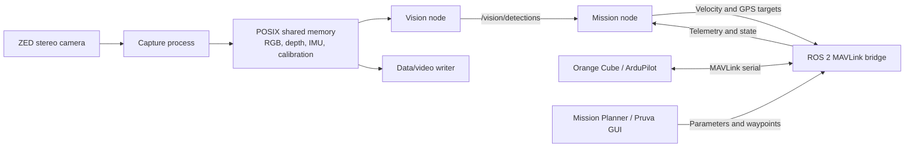

# Pruva Competition

Pruva Competition is an autonomous surface vehicle (USV) software stack for
the Njord and TEKNOFEST competitions. It combines ROS 2 mission control,
MAVLink communication with an ArduPilot-based flight controller, ZED stereo
camera capture, CUDA-accelerated object detection, waypoint handling, telemetry
services, and safe process shutdown.

The repository contains two competition profiles that share the same bridge,
vision, and utility layers while keeping mission-specific behavior isolated.

## Main Features

- Separate Njord and TEKNOFEST mission packages
- ROS 2 and MAVLink bridge for vehicle telemetry and control
- ZED stereo camera RGB, depth, IMU, and calibration capture
- Shared-memory frame transport for low-overhead local processing
- YOLO/TensorRT buoy and AR-tag detection
- Depth-based 3D obstacle detection for Njord Task 2
- QGroundControl waypoint file support
- Mission selection through Mission Planner parameters
- HTTP waypoint upload, telemetry, and video services
- Graceful mission stop, vehicle stop, and disarm handling
- Automated pytest coverage with hardware-dependent checks kept separate

## System Architecture



## Repository Layout

```text
.
├── bridge/                  # Shared ROS 2 and MAVLink bridge
├── models/                  # Local TensorRT model engines (not committed)
├── njord/                   # Njord launcher, missions, config, and services
├── teknofest/               # TEKNOFEST launcher, missions, config, and services
├── tests/
│   ├── common/              # Shared component tests
│   ├── njord/               # Njord mission tests
│   ├── teknofest/           # TEKNOFEST mission tests
│   └── manual/              # Hardware and interactive checks
├── utils/                   # Shared MAVLink, waypoint, logging, and safety helpers
├── vision/                  # Shared detectors and ROS 2 vision node
└── waypoints/               # QGroundControl WPL mission files
```

## Competition Missions

### Njord

| Selection | Mission | Implementation |
|---|---|---|
| `1` | Maneuvering and path finding | `njord/missions/task1_maneuvering_and_path_finding.py` |
| `2` | Collision avoidance | `njord/missions/task2_collision_avoidance.py` |
| `3` | Docking | `njord/missions/task3_docking.py` |
| `4` | Surprise task | `njord/missions/task4_surprise.py` |

Njord uses the `SCR_USER1` ArduPilot parameter for mission selection and
publishes the selected command to `/mission_start`.

### TEKNOFEST

| Selection | Mission | Implementation |
|---|---|---|
| `1` | Point tracking | `teknofest/missions/task1_point_tracking.py` |
| `2` | Point tracking with obstacle avoidance | `teknofest/missions/task2_point_tracking_task_in_an_environment_with_obstacle.py` |
| `3` | Kamikaze engagement | `teknofest/missions/task3_kamikaze_engagement.py` |
| `4` | Continuous Tasks 1 → 2 → 3 | `teknofest/missions/competition_mission.py` |

In Mission Planner interface mode, `SCR_USER3` requests waypoint download and
`SCR_USER2` starts the selected mission.

## Target Platform

The current dependency profile targets:

- NVIDIA Jetson Orin NX
- JetPack 7.2
- Ubuntu 24.04
- CUDA 13
- Python 3.12
- ROS 2 Kilted
- ZED SDK 5.x
- Orange Cube running ArduPilot

The launchers are Linux-oriented and use Bash, POSIX process groups, POSIX
shared memory, ROS setup scripts, and serial devices such as `/dev/ttyACM0`.
Windows can be used for development and unit tests, but not as a complete
vehicle runtime without adaptation.

## Installation

### 1. Install system dependencies

Install JetPack, the ZED SDK, and ROS 2 before installing the Python
requirements. The following is a minimal example; the exact ROS packages may
depend on the target image:

```bash
sudo apt update
sudo apt install libopenblas-dev ros-kilted-ros-base ros-kilted-mavros-msgs
```

Source ROS 2:

```bash
source /opt/ros/kilted/setup.bash
```

### 2. Create a Python 3.12 environment

```bash
python3.12 -m venv .venv
source .venv/bin/activate
python -m pip install --upgrade pip
python -m pip install -r requirements.txt
```

The PyTorch package index in `requirements.txt` targets CUDA 13. Do not use it
unchanged on JetPack 5 or JetPack 6; install the PyTorch build that matches the
installed JetPack release.

### 3. Install the ZED Python API

The ZED Python bindings are provided separately by the installed SDK:

```bash
python /usr/local/zed/get_python_api.py
```

If a compatible wheel is available locally, it can be installed directly:

```bash
python -m pip install pyzed-5.1-cp312-cp312-linux_x86_64.whl
```

### 4. Add model engines

Model weights are runtime assets and are not stored in Git. Copy the TensorRT
engines to these exact paths:

```text
models/
├── ar_tag/ar_tag.engine
├── njord_buoy/njord_buoy.engine
└── teknofest_buoy/teknofest_buoy.engine
```

The engines must be built for the TensorRT, CUDA, GPU architecture, and
Ultralytics versions installed on the target Jetson.

### 5. Verify device access

Check that the flight controller and ZED camera are visible:

```bash
ls -l /dev/ttyACM0
python tests/manual/camera_open_check.py
```

The user running the application must have permission to access the serial
device and camera.

## Running the Application

Run commands from the repository root with the virtual environment active.
Only one bridge process should own the MAVLink serial connection at a time.

### Njord

```bash
python njord/main.py
```

Start Njord Task 3 directly with the selected docking algorithm:

```bash
python3 njord/main.py --task-3 paralel
python3 njord/main.py --task-3 seri
```

These commands select Task 3 through the existing Mission Manager contract.

The Njord launcher:

1. Cleans stale shared-memory segments.
2. Starts the waypoint upload server.
3. Starts ZED capture.
4. Starts telemetry and video services when the camera is available.
5. Starts the ROS 2 bridge, mission manager, and vision node.
6. Waits for the mission selected through `SCR_USER1`.

If ZED capture cannot start, Njord continues in bridge-only mode. Vision,
video, and data writing are disabled in that mode.

### Manual Njord Task 2 Test Recording

Start the normal Njord stack first:

```bash
python njord/main.py
```

In a second terminal, start and stop the test recording independently from the
Task 2 mission:

```bash
python -m njord.collect_dataset --attach --name task2_water_test --fps 5
```

Use `--duration 120` for a fixed two-minute recording, or press `Ctrl+C` for a
safe manual stop. `--attach` reuses the running Njord shared-memory capture and
does not try to open the ZED camera a second time.

Each run is written below
`njord/logs/datasets/<name>/run_<timestamp>_<pid>/` with separate outputs:

- `frames.csv`, `left/`, and `depth/` for camera-aligned RGB and metric depth.
- `gps.csv` for Pixhawk GPS fixes.
- `imu.csv` for ZED and Pixhawk IMU samples, distinguished by `source`.
- `kinematics.csv` for Task 2 obstacle motion and collision-risk estimates.

The files remain separate but carry `frame_id`, camera timestamps, ROS
timestamps, or UTC timestamps so samples from the same test moment can be
matched during analysis.

Njord Task 2 targets 2 knots (approximately `1.03 m/s`) through its dedicated
`/cube/task2_velocity` topic. Normal waypoint navigation varies between 40%
and 100% of that target according to heading error. Collision avoidance does
not create a temporary GPS target: it commands a fixed 2-knot velocity 45
degrees to starboard of the entry heading for 4 seconds, then continues on the
entry heading for at least 3 seconds until the tracked obstacle is behind or
absent for 1 second. It does not change ArduRover `WP_SPEED` or the behavior of
other missions.

### TEKNOFEST

Start Mission Planner interface mode:

```bash
python teknofest/main.py
```

Start a mission directly:

```bash
python teknofest/main.py --task-1
python teknofest/main.py --task-2
python teknofest/main.py --task-3
```

Run all three missions using the competition transition logic:

```bash
python teknofest/main.py --competition
```

Unlike Njord, the TEKNOFEST launcher currently requires successful ZED camera
startup.

Press `Ctrl+C` once to initiate the safe shutdown sequence. The launcher asks
the active mission to stop first, then shuts down vision and the bridge, stops
the capture process, and releases shared-memory resources.

## Default Interfaces

### HTTP services

| Service | Address |
|---|---|
| Waypoint upload | `POST http://<jetson-ip>:8000/api/mission/upload_txt` |
| Waypoint service health | `GET http://<jetson-ip>:8000/health` |
| Njord video stream | `http://<jetson-ip>:5000/video_feed` |
| Njord video health | `http://<jetson-ip>:5000/health` |
| Telemetry/data stream | `http://<jetson-ip>:5001/data/stream` |
| Telemetry/data health | `http://<jetson-ip>:5001/health` |

Waypoint uploads must contain a safe `.waypoints` filename and
QGroundControl WPL text. Example:

```json
{
  "type": "mission_waypoints_upload",
  "mission_name": "task1",
  "filename": "njord_task1.waypoints",
  "content": "QGC WPL 110\n..."
}
```

### Main ROS 2 topics

| Topic | Purpose |
|---|---|
| `/cube/state` | Vehicle connection, mode, and armed state |
| `/cube/gps` | GPS position |
| `/cube/gps/heading` | Vehicle heading |
| `/cube/battery` | Battery state |
| `/cube/telemetry` | Aggregated bridge telemetry |
| `/cube/cmd_vel` | Velocity command input |
| `/cube/set_position` | Global GPS target input |
| `/cube/task2_velocity` | Njord Task 2 metric North/East velocity input |
| `/vision/detections` | JSON-formatted vision detections |
| `/mission/active_task` | Active detector/mission selection |
| `/mission_start` | Mission command from the bridge |
| `/mission_start_ack` | Mission manager acknowledgement |
| `/mission_manager/status` | Mission manager status |
| `/njord/task3/qr_detections` | Njord Task 3 QR payload detections |

The bridge also provides `/cube/set_mode_service`, `/cube/arm`,
`/cube/force_arm`, and `/cube/disarm`.

`/cube/cmd_vel` requires finite `linear.x` and `angular.z` values. If either
value is `NaN` or infinite, the bridge rejects the command, neutralizes the
active outputs, and publishes an error instead of forwarding motion to the
vehicle.

## MAVLink Configuration

The launchers provide competition-specific defaults. Connection-related values
can be configured before launch:

```bash
export MAVLINK_CONNECTION_STRING=/dev/ttyACM0
export MAVLINK_BAUD=921600
export MAVLINK_SOURCE_SYSTEM=1
export MAVLINK_SOURCE_COMPONENT=191
export MAVLINK_HEARTBEAT_TIMEOUT=10
python njord/main.py
```

Important defaults:

| Variable | Default |
|---|---|
| `MAVLINK_CONNECTION_STRING` | `/dev/ttyACM0` |
| `MAVLINK_BAUD` | `921600` |
| `MAVLINK_SOURCE_SYSTEM` | `1` |
| `MAVLINK_SOURCE_COMPONENT` | `191` |
| `MAVLINK_MISSION_START_TOPIC` | `/mission_start` |
| `MAVLINK_MISSION_START_ACK_TOPIC` | `/mission_start_ack` |
| `MAVLINK_DISARM_ON_SHUTDOWN` | `1` |

Competition profiles set their own mission parameter names and waypoint
directories in:

- `njord/config/mission_config.py`
- `teknofest/config/mission_config.py`

## Waypoint Files

Waypoint files use the QGroundControl WPL format and are stored under:

```text
waypoints/njord/
waypoints/teknofest/
```

Files can be updated through the HTTP upload endpoint. The server validates the
filename and file header, rejects path traversal, and atomically replaces the
destination file.

## Testing

Run the full automated suite:

```bash
python -m pytest tests
```

Run focused suites:

```bash
python -m pytest tests/common -q
python -m pytest tests/njord -q
python -m pytest tests/teknofest -q
```

Run a single mission regression test:

```bash
python -m pytest tests/njord/test_task4_surprise.py -q
python -m pytest tests/teknofest/test_task2_obstacle_avoidance.py -q
```

Scripts under `tests/manual/` require the relevant ROS, MAVLink, camera, GUI,
or CUDA hardware/software and are not collected automatically by pytest.

## Development Guidelines

- Keep Njord-specific behavior under `njord/`.
- Keep TEKNOFEST-specific behavior under `teknofest/`.
- Move code to `utils/`, `vision/`, or `bridge/` only when it is genuinely
  shared.
- Add regression tests in the corresponding `tests/common`, `tests/njord`, or
  `tests/teknofest` directory.
- Do not commit model engines, generated logs, datasets, shared-memory dumps,
  virtual environments, or runtime output.
- Validate mission and safety changes with mocked tests first, then perform
  hardware checks only with the vehicle secured.

## Safety Notice

This software can command a real autonomous vehicle. Before a hardware run:

- Secure the vessel and keep a manual stop method available.
- Confirm the correct serial device, target system, and competition profile.
- Verify fresh GPS, heading, bridge state, camera, and vision data.
- Confirm the expected flight mode and armed state from `/cube/state`.
- Test waypoint and mission selection behavior without propulsion first.
- Never run multiple bridge instances against the same flight controller.

Use the software only in a controlled environment and in accordance with the
competition rules and local safety procedures.
