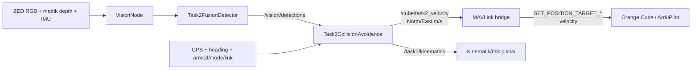
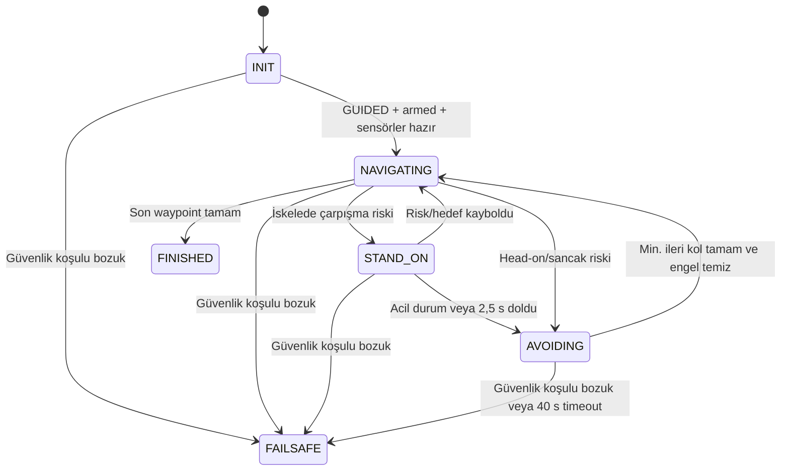

# Njord Task 2 Çarpışmadan Kaçınma Algoritması

## 1. Amaç ve kapsam

Bu doküman, Njord Task 2 görevindeki çarpışma riski değerlendirmesini ve
kaçınma manevrasını mevcut kaynak kodun davranışına göre açıklar. Yalnızca
hedeflenen tasarımı değil, kodun bugün gerçekte yaptığı işlemleri, karar
eşiklerini, kullanılan geometrik denklemleri, durum geçişlerini, güvenlik
önlemlerini ve bilinen sınırlamaları da kapsar.

Ana uygulama:

- `njord/missions/task2_collision_avoidance.py`

İlgili algı, komut ve doğrulama bileşenleri:

- `njord/config/vision_profile.py`
- `njord/config/vision_config.py`
- `vision/task2_fusion_detector.py`
- `vision/usv_3d_detector.py`
- `vision/vision_node.py`
- `bridge/bridge_node.py`
- `utils/mavlink_utilities.py`
- `waypoints/njord/njord_task2.waypoints`
- `tests/njord/test_task2_collision_avoidance.py`
- `tests/common/test_task2_fusion_detector.py`
- `tests/common/test_usv_3d_detector.py`

> Önemli: Kaynak koddaki açıklamaya göre mesafe ve zaman eşikleri yarışma
> varsayımlarıdır; sabit COLREG mesafeleri değildir. Su testleriyle
> ayarlanmaları gerekir.

## 2. Kısa özet

Görev normalde waypoint'lere doğru, kuzey/doğu bileşenleri olan metrik bir hız
vektörü göndererek ilerler. Görüş sistemi 12 metre içinde uygun bir çarpışma
hedefi gördüğünde en yakın hedefi izlemeye alır. En az üç örnek ve en az
0,4 saniyelik iz oluşunca kapanma hızı, TCPA ve DCPA hesaplanır. Hedef 2,5
metreye girmişse iz geçmişi beklenmeden acil risk kabul edilir.

Risk oluştuğunda:

1. Hedef pruvanın önünde veya sancak tarafındaysa tekne `give_way` kabul edilir
   ve manevra hemen başlar.
2. Hedef iskele tarafındaysa tekne önce `stand_on` davranışıyla 2,5 saniye
   rotasını korur.
3. İskele hedefi acil hale gelirse veya 2,5 saniyelik bekleme dolarsa yine
   sancak manevrası başlar.
4. Manevraya giriş başı `H_entry` saklanır.
5. Dört saniye boyunca `H_entry + 45°` yönünde 2 knot hız komutu verilir.
6. Daha sonra en az üç saniye boyunca `H_entry` yönünde 2 knot ile devam
   edilir.
7. Üç saniyelik alt sınır dolduktan sonra, izlenen engel teknenin en az
   1 metre arkasındaysa veya bir saniye boyunca algılanmadıysa kaçınma biter.
8. Geçici GPS waypoint'i oluşturulmaz. Görev, yarım bıraktığı aynı waypoint'e
   geri döner.
9. Manevra toplam 40 saniyeyi aşarsa araç durdurulur ve `HOLD` modu istenir.

Nominal hedef hız:

```text
2 knot × 0,514444 = 1,028888 m/s
```

## 3. Çalışma zamanı veri ve komut akışı



Görev düğümünün kontrol zamanlayıcısı 0,1 saniyede bir, yani nominal olarak
10 Hz çalışır. Görüş mesajları `/vision/detections` üzerinden JSON olarak
gelir. Bir görüş örneği en fazla 1 saniye güncel kabul edilir. Aynı görüş
karesi 10 Hz kontrol döngüsünde tekrar kullanılabilse de iz geçmişine yalnızca
yeni bir kare geldiğinde eklenir. Böylece tek bir kamera karesi yapay olarak
birden fazla hareket örneğine dönüşmez.

Görev aşağıdaki araç verileri güncelse çalışır:

- GPS: en fazla 2 saniye eski olabilir.
- Baş/heading: en fazla 2 saniye eski olabilir.
- MAVLink bridge durumu: en fazla 10 saniye eski olabilir.
- Bridge bağlı olmalıdır.
- Araç `GUIDED` modunda olmalıdır.
- Araç arm edilmiş olmalıdır.

Bu şartlardan biri kaybolursa görev `FAILSAFE` durumuna geçer, sıfır
`/cube/cmd_vel` yayımlar ve `HOLD` modu ister.

## 4. Koordinat ve işaret sözleşmesi

Algoritmanın doğru yorumlanması için üç farklı koordinat gösterimini ayırmak
gerekir.

### 4.1 Kamera/tekne göreli koordinatları

- `forward_m`: teknenin pruvası yönündeki mesafe.
- `starboard_m`: teknenin sancak tarafındaki yanal mesafe.
- Algı mesajındaki alanın adı `lateral_m`, görev içindeki normalize edilmiş
  adı `starboard_m` olur.
- Açı `0°` ise hedef tam öndedir.
- Pozitif açı sancak tarafını gösterir.
- Negatif açı iskele tarafını gösterir.

Algılayıcı `forward_m` ve `lateral_m` sağlamazsa kutupsal ölçüm Kartezyen
ölçüme çevrilir:

```text
forward   = distance × cos(angle)
starboard = distance × sin(angle)
```

### 4.2 Dünya koordinatları

Görev ve bridge arasındaki `/cube/task2_velocity` mesajında:

- `Twist.linear.x`: kuzey hızı, m/s.
- `Twist.linear.y`: doğu hızı, m/s.

Bir `B` kerterizinde ve `V` hızında yayımlanan bileşenler:

```text
V_north = V × cos(B)
V_east  = V × sin(B)
```

Burada `B`, kuzeyden saat yönünde ölçülen mutlak kerterizdir.

### 4.3 Göreli konumun dünyaya döndürülmesi

Kinematik hesabında tekneye göre ölçülen hedef konumu, ölçüm anındaki
`heading` kullanılarak kuzey/doğu eksenlerine döndürülür:

```text
rel_north = forward × cos(heading) - starboard × sin(heading)
rel_east  = forward × sin(heading) + starboard × cos(heading)
```

## 5. Çarpışma hedefinin algılanması

### 5.1 Task 2 görüş profili

Task 2 aktifken `Task2FusionDetector` seçilir. Bu algılayıcı iki bilgi
kaynağını bir araya getirebilir:

- Metrik derinlikten su yüzeyi ve 3B engel geometrisi.
- eWaSR semantik su/engel segmentasyonu.

Profilde derinlik algı menzili 12 metredir, su düzlemi RANSAC hesabı için 350
iterasyon kullanılır ve eWaSR varsayılan olarak 5 Hz çalışır.

### 5.2 Metrik derinlik algısının özeti

`USV3DObstacleDetector` yaklaşık olarak şu işlemleri yapar:

1. Geçerli depth piksellerini kamera iç parametreleriyle 3B noktalara çevirir.
2. RANSAC ve önceki karedeki düzlem öncülüyle su düzlemini kestirir.
3. Su düzleminin üzerindeki noktaları yükseklik ve menzil eşikleriyle seçer.
4. Noktaları kuşbakışı düzlemde 0,08 metrelik hücrelere ayırır.
5. Komşu hücreleri bağlı bileşenler halinde kümeler.
6. Yetersiz nokta/hücre içeren veya fiziksel boyut sınırlarını aşan kümeleri
   eler.
7. Kabul edilen her küme için en yakın menzil, merkez menzili, kerteriz,
   `forward_m`, `lateral_m`, genişlik, uzunluk ve yükseklik üretir.

Göreve verilen `distance`, kümenin merkez mesafesi değil, küme noktalarının
planar menzillerinin yüzde 10'luk değeridir (`nearest_range_m`). Bu seçim,
çarpışma kararında engelin tekneye en yakın bölümünü öne çıkarır.

### 5.3 Füzyon ve shadow modu

eWaSR ile derinlik geometrisi örtüşürse algı `fused_obstacle` olabilir.
Yalnız semantik maskede görülen bir nesnenin yeterli ve su düzlemiyle uyumlu
metrik depth desteği varsa `seg_depth_obstacle` üretilebilir. Metrik desteği
olmayan semantik bölge `visual_obstacle_candidate` olarak kalır.

Mevcut varsayılan ayar:

```text
NJORD_TASK2_FUSION_SHADOW=true
```

Bu nedenle varsayılan canlı kontrol yolunda:

- `/vision/detections` içine yalnız derinlik tabanlı `depth_obstacle`
  sonuçları gider.
- Füzyon sonuçları hesaplanır fakat `/vision/task2_fusion_debug` üzerinde
  değerlendirme amacıyla yayımlanır.
- eWaSR, varsayılan durumda kontrol kararını değiştirmez.

`NJORD_TASK2_FUSION_SHADOW=false` yapılırsa metrik füzyon sonuçları canlı
kontrol yoluna girer. Derinlik algısı segmentasyon tarafından veto edilmez;
segmentasyon çalışmasa bile sistem mevcut derinlik algılarına açık kalır.

### 5.4 Görevin kabul ettiği hedef tipleri

Görev aşağıdaki algıları çarpışma hedefi olarak kabul eder:

- `type == "vessel"`.
- Model sınıfı `vessel`, `boat` veya `ship`.
- Tanımlı güncel ya da eski isimlerden birine sahip `buoy`.
- Sınıfı `surface_obstacle_candidate` olan:
  - `depth_obstacle`
  - `fused_obstacle`
  - `seg_depth_obstacle`

Metrik mesafesi olmayan `visual_obstacle_candidate` bilinçli olarak çarpışma
hedefi değildir.

Task 2'nin mevcut görüş profilinde yalnız `task2_fusion` algılayıcısı aktif
olduğu için canlı varsayılan kaynak derinlik engelleridir. Kodun buoy ve vessel
desteği, eski/kayıtlı veri biçimleri ve alternatif algı girişleriyle uyumluluk
sağlar; Task 2 profili ayrıca buoy algılayıcısını çalıştırmaz.

Bir algının kullanılabilmesi için:

- Sözlük biçiminde olması.
- Sonlu ve sıfırdan büyük `distance` içermesi.
- Tanınan anahtarlardan birinde sonlu bir açı içermesi.
- 12 metrelik izleme menzili içinde olması gerekir.

Açı için geriye dönük uyumluluk sırası:

```text
"Vessel angle: ", "Vessel angle",
"Buoy angle: ",   "Buoy angle",
"bearing", "angle_deg", "angle"
```

Kaçınma başlamadan önce aynı karede birden fazla geçerli hedef varsa yalnızca
en yakın hedef seçilir.

## 6. Hedef izi ve süreklilik

Görev en fazla 12 gözlem tutan bir `deque` kullanır. Her gözlem şunları içerir:

- Kamera veya yerel monoton zaman damgası.
- `frame_id`.
- Varsa `track_id`.
- Mesafe ve göreli açı.
- `forward_m` ve `starboard_m`.
- Teknenin GPS konumu ve heading değeri.

Yeni gözlem, önceki örnekle aşağıdaki koşullardan birini sağlarsa mevcut iz
silinir ve yeni iz başlatılır:

- Her iki örnekte de `track_id` vardır ve kimlik değişmiştir.
- Açı sıçraması 30 dereceden büyüktür.
- Mesafe sıçraması 5 metreden büyüktür.
- Örnekler arasındaki zaman 1,5 saniyeden büyüktür.

`track_id` tercih edilir; fakat derinlik algılayıcısı bugün `track_id=None`
üretir. Bu yüzden canlı derinlik yolunda iz sürekliliği çoğunlukla açı, mesafe
ve zaman geometrisine dayanır.

## 7. Kapanma ve kinematik hesabı

### 7.1 Hesabın başlayabilmesi

Normal risk hesabı için:

```text
örnek sayısı >= 3
ve
son zaman - ilk zaman >= 0,4 saniye
```

gereklidir. Bu şartlar dolmadan değerlendirme sonucu `collecting_track` olur.

2,5 metre veya daha yakın bir hedef bu beklemeyi atlar ve doğrudan
`emergency_distance` riski üretir.

### 7.2 Kapanma hızı

İzin ilk ve son mesafesi kullanılır:

```text
closing_rate = (distance_first - distance_latest) / elapsed
```

- Pozitif değer hedefin yaklaştığını gösterir.
- `closing_rate < 0,05 m/s` ise hedef kapanmıyor kabul edilir.
- Uzaklaşan veya hemen hemen sabit mesafedeki hedef kaçınma başlatmaz.

Bu aşamadan sonra CPA ve sabit kerteriz denetimleri yalnız gerçekten kapanan
hedefler için yapılır.

### 7.3 Göreli hız

İlk ve son göreli Kartezyen konumlardan:

```text
v_forward   = (forward_latest - forward_first) / elapsed
v_starboard = (starboard_latest - starboard_first) / elapsed
|v_rel|²    = v_forward² + v_starboard²
```

Bu, hedefin tekneye göre hızıdır. Risk hesabı sabit göreli hız varsayımı yapar.

### 7.4 TCPA

Son göreli konum vektörü `r` ve göreli hız `v` olmak üzere:

```text
TCPA = -(r · v) / (v · v)
```

Kod karşılığı:

```text
TCPA =
    -(forward_latest × v_forward
      + starboard_latest × v_starboard)
    / (v_forward² + v_starboard²)
```

Göreli hızın karesi `1e-6` değerinden küçükse TCPA/DCPA hesaplanmaz. Negatif
TCPA, en yakın yaklaşma anının geçmişte olduğunu gösterir ve DCPA üretiminde
kullanılmaz.

### 7.5 DCPA

`TCPA >= 0` ise en yakın yaklaşmadaki konum:

```text
CPA_forward   = forward_latest + v_forward × TCPA
CPA_starboard = starboard_latest + v_starboard × TCPA
```

En yakın geçiş mesafesi:

```text
DCPA = sqrt(CPA_forward² + CPA_starboard²)
```

Şu iki şart birlikte sağlanırsa `unsafe_cpa` riski oluşur:

```text
0 <= TCPA <= 15 saniye
DCPA <= 2,5 metre
```

### 7.6 Sabit kerteriz–azalan mesafe yedeği

CPA şartı risk üretmezse iz içindeki açının yayılımı hesaplanır:

```text
angle_span = max(angle_samples) - min(angle_samples)
```

Aşağıdaki şartlar birlikte sağlanırsa
`constant_bearing_closing_range` riski oluşur:

```text
closing_rate >= 0,05 m/s
son mesafe <= 4,5 metre
angle_span <= 8 derece
```

Bu yedek, hedef kerterizi yaklaşık sabit kalırken menzil azalıyorsa olası
çarpışmayı CPA kestirimi güvenilir olmasa da yakalamaya çalışır.

### 7.7 Risk nedenlerinin öncelik sırası

Değerlendirme sırası önemlidir:

1. İz yok: `no_track`.
2. Son mesafe en fazla 2,5 m: `emergency_distance`.
3. İz henüz kısa: `collecting_track`.
4. Kapanma yetersiz: `not_closing`.
5. TCPA/DCPA tehlikeli: `unsafe_cpa`.
6. Sabit kerteriz ve yakınlaşma: `constant_bearing_closing_range`.
7. Diğer kapanan geçişler: `safe_cpa`.

## 8. Karşılaşma türü ve COLREG rolü

Risk oluştuktan sonra yalnız mevcut kamera göreli açısı kullanılarak rol
belirlenir:

| Göreli açı | Sınıflandırma | Teknenin rolü | Davranış |
|---|---|---|---|
| `-15° <= angle <= +15°` | `head_on` | `give_way` | Hemen sancak kaçınması |
| `angle > +15°` | `crossing_starboard` | `give_way` | Hemen sancak kaçınması |
| `angle < -15°` | `crossing_port` | `stand_on` | Önce 2,5 s rotayı koru |

İskele tarafındaki riskte bekleme sırasında waypoint navigasyonu devam eder.
Aşağıdaki durumlardan biri oluşursa 2,5 saniyeyi beklemeden manevra başlar:

```text
distance <= 2,5 metre
veya
TCPA <= 4 saniye
```

Acil durum oluşmazsa aynı risk 2,5 saniye sürdüğünde sancak manevrası başlar.
Risk veya hedef ortadan kalkarsa `STAND_ON` sıfırlanır ve normal navigasyona
dönülür.

Bu sınıflandırma tam bir COLREG yorumlayıcısı değildir. Hedefin gerçek rota ve
hız kestirimi telemetri için hesaplansa da rol seçiminde kullanılmaz. Bu
nedenle yetişme/overtaking karşılaşması ayrı sınıflandırılmaz; öndeki hedef
korumacı biçimde head-on kabul edilir.

## 9. Durum makinesi



| Durum | Anlamı |
|---|---|
| `INIT` | Görev henüz aktif hareket döngüsüne alınmamıştır. |
| `NAVIGATING` | Mevcut waypoint'e normal hız vektörüyle gidilir. |
| `STAND_ON` | İskeledeki risk izlenirken mevcut rota korunur. |
| `AVOIDING` | İki fazlı zaman kontrollü sancak manevrası yürütülür. |
| `FINISHED` | Tüm waypoint'ler tamamlanmış ve araç durdurulmuştur. |
| `FAILSAFE` | Hareket kesilmiş, `HOLD` istenmiştir. |

## 10. Kaçınma manevrasının ayrıntısı

### 10.1 Manevraya girişte saklanan bilgiler

Kaçınma başlarken:

- Durum `AVOIDING` yapılır.
- Toplam manevra başlangıç zamanı kaydedilir.
- Faz başlangıç zamanı kaydedilir.
- Faz `starboard` yapılır.
- O andaki gerçek heading, `avoidance_entry_heading` olarak dondurulur.
- Varsa hedefin `track_id` değeri saklanır.
- Hedefin mesafe/açı geometrisi referans olarak saklanır.
- Hedefin giriş anındaki mutlak kerterizi hesaplanır:

```text
obstacle_absolute_bearing =
    (entry_heading + relative_obstacle_angle) mod 360
```

Waypoint indeksi değiştirilmez. Önceki waypoint hizalama işareti temizlenir.

### 10.2 Faz 1: Sancak kolu

Süre:

```text
4,0 saniye
```

Komut kerterizi:

```text
B_starboard = (H_entry + 45°) mod 360°
```

Komut hızı:

```text
V = 1,028888 m/s = 2 knot
```

Kuzey/doğu hız komutu:

```text
V_north = 1,028888 × cos(B_starboard)
V_east  = 1,028888 × sin(B_starboard)
```

Bu kol boyunca hedefin anlık açısına göre dönüş açısı yeniden hesaplanmaz.
Giriş heading'ine göre sabit, dünya eksenli bir hız vektörü komut edilir.

Örnek: giriş heading'i `0°` ise:

```text
B_starboard = 45°
V_north ≈ 0,7275 m/s
V_east  ≈ 0,7275 m/s
```

Giriş heading'i `350°` ise mod işlemi nedeniyle hedef kerteriz `35°` olur.

### 10.3 Faz 2: Giriş başında ileri kol

Dört saniye dolunca faz `forward` olur ve faz süresi sıfırlanır.

Komut kerterizi:

```text
B_forward = H_entry
```

Hız yine 2 knot'tır:

```text
V_north = 1,028888 × cos(H_entry)
V_east  = 1,028888 × sin(H_entry)
```

Bu faz en az 3,0 saniye sürer. Üç saniye dolmadan engel kaybolsa veya arkaya
geçse bile normal navigasyona dönülmez.

### 10.4 Kaçınmanın bitiş şartları

Üç saniyelik minimum ileri kol tamamlandıktan sonra aşağıdakilerden biri
gerekir.

#### A. Engel arkada

Metrik `forward_m` varsa doğrudan kullanılır. Yoksa mesafe/açıdan hesaplanır:

```text
forward = distance × cos(angle)
```

Şart:

```text
forward <= -1,0 metre
```

Bu, engelin tekne referans noktasının en az 1 metre arkasında olduğunu ifade
eder.

#### B. Engel algısı temiz

İzlenen hedef bir saniye kesintisiz bulunamazsa temiz kabul edilir:

```text
absence_duration >= 1,0 saniye
```

Görüş örneği ayrıca 1 saniyeye kadar güncel sayıldığı için, algı yayınının
tamamen kesildiği bir durumda son gerçek mesajdan bitiş kararına kadar yaklaşık
2 saniyelik bir bileşik gecikme oluşabilir:

1. Son örneğin 1 saniyelik güncellik süresi.
2. Boş algı başladıktan sonraki 1 saniyelik temizleme onayı.

Kontrol zamanlaması bu süreye yaklaşık bir döngülük ek fark getirebilir.

Engel yeniden görülürse temizleme sayacı sıfırlanır.

### 10.5 İleri kolun uzaması

Minimum üç saniye dolduğu halde izlenen engel hâlâ ön/yan tarafta görülüyorsa
ileri kol aynı `H_entry` kerterizinde uzar. Manevra başlangıcından itibaren
toplam süre 40 saniyeye ulaşana kadar devam edebilir.

Toplam süre:

```text
total_avoidance_elapsed >= 40 saniye
```

olursa `FAILSAFE` tetiklenir.

### 10.6 Normal rotaya dönüş

Kaçınma başarıyla bitince:

- Durum `NAVIGATING` yapılır.
- Faz, süre, giriş heading'i ve hedef eşleme bilgileri temizlenir.
- Risk izi temizlenir.
- `current_target_index` değiştirilmez.
- Bir sonraki kontrol döngüsünde aynı görev waypoint'ine yönelim yeniden
  hesaplanır.

Kaçınma sırasında:

- Geçici GPS hedefi oluşturulmaz.
- `/cube/set_position` kullanılmaz.
- ArduRover `WP_SPEED` değiştirilmez.
- Yalnız `/cube/task2_velocity` kullanılır.

## 11. Kaçınma sırasında aynı engeli takip etme

Manevrayı başlatan hedefin yerine başka bir hedefin yanlışlıkla geçmesini
azaltmak için kaçınma sırasında genel “en yakın engel” seçimi kullanılmaz.

### 11.1 `track_id` varsa

Yalnız aynı `track_id` değerine sahip hedef kabul edilir. Başka bir hedef daha
yakın olsa bile manevranın aktif hedefi olarak seçilmez.

### 11.2 `track_id` yoksa

Derinlik engellerinde olduğu gibi kimlik yoksa adayın mutlak kerterizi
hesaplanır:

```text
candidate_absolute_bearing =
    (current_heading + candidate_relative_angle) mod 360
```

Aday şu kapılardan geçmelidir:

```text
|bearing_error(candidate, entry_reference)| <= 45°
|candidate_distance - last_reference_distance| <= 4 m
```

Birden fazla aday geçerse skor:

```text
score =
    bearing_delta / 45
    + distance_delta / 4
```

olur ve en küçük skor seçilir. Seçilen aday son mesafe referansını günceller.
Mutlak kerteriz referansı ise manevraya girişte hesaplanan değerdir; her karede
yeniden hedef hareketine göre kaydırılmaz.

Bu yöntem, teknenin heading'i değiştiğinde kamera göreli açı değişse bile aynı
dünya kerterizindeki hedefi bulmaya çalışır.

## 12. Normal waypoint navigasyonuyla ilişkisi

Task 2 waypoint dosyasındaki QGroundControl `seq=0` HOME satırı rota listesinden
çıkarılır. Mevcut dosyada görev için iki gerçek waypoint vardır.

Waypoint'e uzaklık 1 metre veya altına indiğinde:

1. Araç durdurulur.
2. 0,75 saniyelik yerleşme/bekleme başlatılır.
3. Waypoint indeksi artırılır.
4. Bekleme bitince yeni waypoint yönündeki hız vektörü yayımlanır.

Normal navigasyonda hedef hız, heading hatasına göre 2 knot'ın yüzde 40'ı ile
yüzde 100'ü arasında değiştirilir:

```text
turn_fraction =
    clamp((|heading_error| - 15°) / (90° - 15°), 0, 1)

speed_fraction = 1,0 - (1,0 - 0,4) × turn_fraction
speed           = 1,028888 × speed_fraction
```

Sonuç:

- Heading hatası `<= 15°`: yaklaşık `1,029 m/s`.
- Heading hatası `>= 90°`: yaklaşık `0,412 m/s`.
- Aradaki hatalarda doğrusal ara değer.

Kaçınmada bu azaltma uygulanmaz; iki faz da sabit 2 knot komut eder.

## 13. Bridge ve Orange Cube'a gönderilen komut

Bridge, `/cube/task2_velocity` mesajını yalnız geçerli MAVLink bağlantısı ve
uygun GUIDED hareket durumu varsa kabul eder.

Bridge doğrulamaları:

- Kuzey ve doğu bileşenleri sonlu olmalıdır.
- Toplam hız `2,0 m/s` güvenlik sınırını aşmamalıdır.

Geçerli komut `set_global_velocity(...)` ile MAVLink dünya eksenli hız
hedefine çevrilir. Hız sıfırdan büyükse bridge'in heading setpoint'i de
`atan2(east, north)` ile hız vektörünün kerterizine güncellenir.

Task 2'nin `1,028888 m/s` hedefi bridge'in 2,0 m/s üst sınırının altındadır.

## 14. Algoritmik sözde kod

```text
her 0,1 saniyede:
    eğer görev FINISHED veya FAILSAFE ise:
        dön

    GPS, heading, bridge bağlantısı, GUIDED ve armed durumunu doğrula
    herhangi biri geçersizse:
        aracı durdur
        HOLD iste
        FAILSAFE'e geç
        dön

    eğer waypoint bekleme süresi aktifse:
        aracı durdur
        dön

    eğer tüm waypoint'ler tamamlandıysa:
        aracı durdur
        FINISHED'e geç
        dön

    eğer durum AVOIDING ise:
        manevrayı başlatan engelle eşleşen hedefi bul
    değilse:
        12 m içindeki en yakın geçerli hedefi bul

    eğer yeni kamera karesi ve hedef varsa:
        hedefi normalize et
        süreklilik bozulduysa izi temizle
        gözlemi 12 elemanlı ize ekle

    risk =
        mesafe <= 2,5 m
        VEYA
        (
            örnek >= 3
            VE süre >= 0,4 s
            VE kapanma >= 0,05 m/s
            VE (
                (TCPA 0..15 s VE DCPA <= 2,5 m)
                VEYA
                (mesafe <= 4,5 m VE açı yayılımı <= 8°)
            )
        )

    eğer durum AVOIDING ise:
        eğer toplam manevra >= 40 s:
            dur, HOLD iste, FAILSAFE
        aksi halde starboard fazı < 4 s ise:
            2 knot ile H_entry + 45° yönünde git
        aksi halde:
            forward fazına geç veya devam et
            2 knot ile H_entry yönünde git
            eğer forward >= 3 s VE
               (engel forward <= -1 m VEYA 1 s algı yok):
                kaçınma durumunu temizle
                aynı waypoint'e dön
        dön

    eğer risk varsa:
        karşılaşma rolünü son göreli açıdan belirle

        eğer head-on veya hedef sancakta ise:
            hemen AVOIDING'e geç
            dön

        eğer hedef iskelede ise:
            STAND_ON'a geç
            eğer mesafe <= 2,5 m
               VEYA TCPA <= 4 s
               VEYA risk 2,5 s sürdü:
                AVOIDING'e geç
                dön

    risk yoksa STAND_ON sayacını temizle ve NAVIGATING yap

    mevcut waypoint'e heading-hatasına göre ölçekli hız vektörü gönder
    waypoint 1 m içinde ise:
        dur
        0,75 s bekleme başlat
        waypoint indeksini artır
```

## 15. Örnek: önden kapanan hedef

Tekne heading'i `0°`, hedef açısı `0°` ve yeni kamera örnekleri:

| Zaman | Mesafe |
|---|---:|
| `10,0 s` | `6,0 m` |
| `10,3 s` | `5,0 m` |
| `10,6 s` | `4,0 m` |

Kapanma hızı:

```text
(6,0 - 4,0) / (10,6 - 10,0)
= 3,333 m/s
```

Basitleştirilmiş doğrusal örnekte:

```text
v_forward = (4,0 - 6,0) / 0,6 = -3,333 m/s
TCPA      = -4,0 × (-3,333) / (-3,333)² ≈ 1,2 s
DCPA      = 0 m
```

Sonuç:

- TCPA 15 saniyeden küçüktür.
- DCPA 2,5 metreden küçüktür.
- Risk `unsafe_cpa` olur.
- Açı ±15 derece içinde olduğu için karşılaşma `head_on/give_way` olur.
- Tekne 4 saniye boyunca `45°` kerterizinde yaklaşık
  `(0,7275 north, 0,7275 east) m/s` komut eder.
- Ardından en az 3 saniye `0°` kerterizinde
  `(1,0289 north, 0 east) m/s` komut eder.
- Temizleme şartı oluşunca aynı waypoint'e geri döner.

## 16. Parametre özeti

### 16.1 Çarpışma riski

| Sabit | Değer | İşlev |
|---|---:|---|
| `MONITOR_DISTANCE_M` | `12,0 m` | Hedef seçme üst menzili |
| `AVOIDANCE_START_DISTANCE_M` | `4,5 m` | Sabit kerteriz yedeğinin yakınlık sınırı |
| `EMERGENCY_DISTANCE_M` | `2,5 m` | İz beklemeden acil risk |
| `SAFE_DCPA_M` | `2,5 m` | Güvensiz en yakın geçiş sınırı |
| `MAX_TCPA_SEC` | `15,0 s` | Risk için ileri zaman ufku |
| `EMERGENCY_TCPA_SEC` | `4,0 s` | Stand-on beklemesini kesen TCPA |
| `MIN_TRACK_SPAN_SEC` | `0,4 s` | Risk/kinematik için minimum iz süresi |
| `MIN_TRACK_SAMPLES` | `3` | Minimum gözlem sayısı |
| `MIN_CLOSING_RATE_MPS` | `0,05 m/s` | Yaklaşıyor sayılma alt sınırı |
| `CONSTANT_BEARING_SPAN_DEG` | `8°` | Sabit kerteriz yayılımı |
| `HEAD_ON_HALF_ANGLE_DEG` | `15°` | Önden karşılaşma yarı açısı |
| `STAND_ON_GRACE_SEC` | `2,5 s` | İskele riskinde rotayı koruma süresi |

### 16.2 Kaçınma hareketi

| Sabit | Değer | İşlev |
|---|---:|---|
| `TASK_TARGET_SPEED_KNOTS` | `2,0 kn` | Görev ve kaçınma hedef hızı |
| `TASK_TARGET_SPEED_M_S` | `1,028888 m/s` | SI hız karşılığı |
| `AVOIDANCE_STARBOARD_ANGLE_DEG` | `45°` | Giriş heading'ine sancak ofseti |
| `AVOIDANCE_STARBOARD_DURATION_SEC` | `4,0 s` | İlk kol süresi |
| `AVOIDANCE_FORWARD_MIN_DURATION_SEC` | `3,0 s` | İkinci kol minimum süresi |
| `AVOIDANCE_CLEAR_CONFIRM_SEC` | `1,0 s` | Kesintisiz algı yokluğu süresi |
| `AVOIDANCE_BEHIND_MARGIN_M` | `1,0 m` | Arkada kabul etme payı |
| `AVOIDANCE_TIMEOUT_SEC` | `40,0 s` | Toplam manevra üst sınırı |
| `AVOIDANCE_MATCH_MAX_BEARING_DELTA_DEG` | `45°` | Kimliksiz hedef eşleme açı kapısı |
| `AVOIDANCE_MATCH_MAX_DISTANCE_DELTA_M` | `4,0 m` | Kimliksiz hedef eşleme mesafe kapısı |

### 16.3 Veri ve navigasyon

| Sabit | Değer | İşlev |
|---|---:|---|
| `VISION_DETECTION_TIMEOUT_SEC` | `1,0 s` | Görüş örneği güncellik süresi |
| `GPS_TIMEOUT_SEC` | `2,0 s` | GPS güvenlik timeout'u |
| `HEADING_TIMEOUT_SEC` | `2,0 s` | Heading güvenlik timeout'u |
| `BRIDGE_STATE_TIMEOUT_SEC` | `10,0 s` | Bridge durumu timeout'u |
| `WAYPOINT_TOLERANCE_M` | `1,0 m` | Waypoint'e varış yarıçapı |
| `WAYPOINT_SETTLE_SEC` | `0,75 s` | Waypoint sonrası durma süresi |
| `WAYPOINT_HEADING_TOLERANCE_DEG` | `15°` | Tam hız heading toleransı |
| `TASK_MIN_TURN_SPEED_FRACTION` | `0,4` | Keskin normal dönüşte hız alt oranı |

## 17. Kinematik ve tanılama çıktıları

Her yeni görüş karesinde `/task2/kinematics` konusuna JSON yayımlanabilir.
İçerik özetle:

- Sistem, kamera ve kare zaman/kimlik bilgileri.
- Algı var/yok bilgisi.
- Hedef `track_id`.
- Mesafe ve göreli kerteriz.
- Göreli rota ve hız.
- Tahmini gerçek rota ve hız.
- Kapanma hızı.
- TCPA ve DCPA.
- Risk bayrağı ve risk nedeni.
- Teknenin GPS ve heading bilgisi.

Hedefin gerçek hızı şu varsayımla tahmin edilir:

```text
target_true_velocity =
    own_ship_gps_velocity + target_relative_velocity
```

Yerel GPS hareketi küçük mesafeli küresel yaklaşım ile kuzey/doğu metrelerine
çevrilir. Bu kinematik bilgiler loglama ve tanılama içindir; mevcut karşılaşma
rolü ve kaçınma kerterizi bunlardan türetilmez.

CSV kayıt varsayılan olarak kendiliğinden başlamaz.
`start_kinematics_recording()` çağrılırsa kayıt dizini:

```text
njord/logs/task2_vessel_kinematics/
```

olur. `NJORD_TASK2_KINEMATICS_DIR` ile değiştirilebilir.

## 18. Testlerle doğrulanan davranışlar

Otomatik testler şu kritik davranışları doğrular:

- Uzaklaşan hedef kaçınma başlatmaz.
- Önden kapanan hedef sabit sancak hız vektörü başlatır.
- Sancak kerterizi farklı giriş heading'lerinde doğru mod işlemiyle oluşur.
- Tanımlı buoy sınıfları ve metrik depth/fusion engelleri hedef kabul edilir.
- Yalnız görsel, metrik olmayan semantik bölge hedef kabul edilmez.
- Manevra sırasında aynı `track_id` izlenir.
- `track_id` yokken heading değişimi mutlak kerteriz eşlemesiyle karşılanır.
- Kaçınma geçici GPS hedefi yayımlamaz.
- İskele riski önce `STAND_ON`, sonra zamanlı sancak manevrası üretir.
- Dört saniyelik sancak ve en az üç saniyelik ileri faz sırası korunur.
- Engel önde kaldıkça ileri faz uzar.
- Engel arkaya geçtiğinde manevra biter.
- 40 saniyelik timeout `FAILSAFE` ve `HOLD` isteği üretir.
- Kaçınma bitince aynı waypoint indeksi korunur.
- Yalnız Task 2 metrik hız konusu kullanılır.
- Göreli/gerçek hedef hız ve rota tahmini üretilir.
- Shadow modunda canlı derinlik sözleşmesi korunur ve füzyon ayrıca raporlanır.

İnceleme sırasında ilgili otomatik test sonucu:

```text
35 passed, 10 subtests passed
```

Çalıştırılan kapsam:

```text
tests/njord/test_task2_collision_avoidance.py
tests/common/test_task2_fusion_detector.py
```

## 19. Mevcut uygulamanın sınırlamaları ve dikkat noktaları

### 19.1 En yakın tek hedef yaklaşımı

Kaçınma başlamadan önce yalnız en yakın hedef değerlendirilir. Daha uzaktaki
bir hedefin TCPA/DCPA değeri daha tehlikeli olsa bile o karede hesaba
girmeyebilir.

Kaçınma başladıktan sonra aynı hedefe bağlı kalmak amaçlanır. Bu, hedef
kararlılığını artırır; ancak farklı `track_id` değerine sahip yeni ve daha
yakın bir engelin aktif manevra hedefi olarak ele alınmaması anlamına da gelir.

### 19.2 Kestirim yalnız ilk ve son örneği kullanır

CPA ve hız hesabı izdeki tüm örneklere regresyon uygulamaz. İlk ve son örnek
arasındaki fark kullanılır. Depth gürültüsü, GPS sıçraması veya heading
gürültüsü doğrudan hız ve CPA sonucunu etkileyebilir.

### 19.3 Sabit hız varsayımı

TCPA/DCPA hesabı hedef ile teknenin göreli hızının yakın gelecekte sabit
kalacağını varsayar. Hızla manevra yapan hedeflerde sonuç kısa sürede
geçersizleşebilir.

### 19.4 Genişlik risk hesabında kullanılmıyor

Algı `width_m` değerini normalize edip saklar; ancak DCPA güvenlik sınırına
engelin yarı genişliği veya teknenin gövde genişliği eklenmez. Mevcut DCPA
noktasal hedef geometrisi kullanır.

### 19.5 Overtaking sınıflandırması yok

Hedefin tahmini gerçek rotası ve hızı hesaplansa da COLREG rolüne katılmaz.
Öndeki tüm hedefler korumacı biçimde head-on/give-way kabul edilir.

### 19.6 Kaçınma açık çevrim ve sabit hızlıdır

Kaçınma kerterizi giriş heading'inden bir kez üretilir. Hedefin sonraki
hareketine göre yeni optimum rota, dinamik açı veya hız planlanmaz. Acil
mesafede de kaçınma hızı 2 knot'tır; ayrıca yavaşlama/geri hareket davranışı
yoktur.

### 19.7 Kimliksiz hedef eşleme karışabilir

Canlı derinlik engellerinde `track_id` yoktur. ±45 derece ve ±4 metre kapıları
birden fazla yakın engelin bulunduğu sahnede hedef değişimine izin verebilir.
Ayrıca mutlak kerteriz referansı giriş anında sabitlenir; hareketli hedefin
kerterizi büyük ölçüde değişirse eşleşme kaybolabilir.

### 19.8 Füzyon varsayılan olarak kontrol dışıdır

eWaSR etkin olsa bile varsayılan shadow ayarında semantik füzyon canlı kaçınma
kararını etkilemez. Canlı sistem davranışı değerlendirilirken debug füzyon
çıktısı ile `/vision/detections` çıktısı birbirine karıştırılmamalıdır.

### 19.9 Kamera görüş alanı dışı “temiz” sayılabilir

Bir hedef manevra nedeniyle kameranın görüş alanından çıkarsa, sistem bunu
gerçekten fiziksel olarak temizlenmiş hedef ile ayırt edemez. Bir saniyelik
algı yokluğu ve minimum ileri kol tamamlandığında kaçınma bitebilir.

### 19.10 Eşikler gövde ve saha koşullarına bağlıdır

`2,5 m DCPA`, `2,5 m acil mesafe`, `4,5 m sabit kerteriz başlatma mesafesi`,
4 saniyelik sancak kolu ve 2 knot hız; tekne dönüş dinamiği, akıntı, rüzgâr,
kamera gecikmesi ve gerçek gövde boyutlarıyla birlikte su testinde
doğrulanmalıdır.

## 20. Kod incelemesinde bulunan ayrı çalışma zamanı riski

Kaçınma algoritmasından bağımsız olarak waypoint sonrası bekleme kolunda şu
çağrı bulunur:

```python
publish_cmd_vel(
    self.topics.cmd_vel_pub,
    self.topics.cmd_vel_pub,
    linear_x=0.0,
    angular_z=0.0,
)
```

Gerçek yardımcı imzası:

```python
publish_cmd_vel(cmd_vel_pub, linear_x, angular_z)
```

İkinci pozisyonel argüman `linear_x` değerini zaten doldurduğu için aynı
parametre bir de anahtar kelimeyle verilir. Gerçek çalışma zamanında bu çağrı:

```text
TypeError: publish_cmd_vel() got multiple values for argument 'linear_x'
```

üretebilir. `Task2Node.timer_callback()` genel istisna yakaladığı için sonuç
görevin `FAILSAFE` durumuna geçmesi olabilir.

Mevcut Task 2 testleri `publish_cmd_vel` fonksiyonunu esnek `*args, **kwargs`
alan bir stub ile değiştirdiğinden bu imza uyumsuzluğunu yakalamaz. Bu konu
kaçınma karar matematiğini değiştirmez; ancak waypoint'e ulaşıldıktan sonraki
görev devamlılığı için düzeltilmesi ve gerçek yardımcı imzasını kullanan bir
regresyon testi eklenmesi gerekir.

## 21. Su testi için önerilen doğrulama sırası

Bu bölüm mevcut algoritmanın açıklamasıdır; kodda otomatik uygulanan bir süreç
değildir.

1. `/vision/detections` içindeki aktif kontrol algılarının shadow debug
   algılarından ayrı kaydedildiğini doğrulayın.
2. Sabit hedefte `distance`, `forward_m`, `lateral_m` ve açı işaretlerini
   ölçün.
3. Sancak/pozitif ve iskele/negatif açı sözleşmesini fiziksel sahada
   doğrulayın.
4. Düz yaklaşmada kapanma hızı, TCPA ve DCPA kayıtlarını yer gerçeğiyle
   karşılaştırın.
5. Farklı giriş heading'lerinde `H_entry + 45°` hız vektörünü doğrulayın.
6. Dört saniyelik ilk kolun gerçek tekne izi ve yanal açıklığını ölçün.
7. İleri kolun 3 saniyeden önce bitmediğini doğrulayın.
8. Hedef kameradan çıkınca algı timeout'u ile temizleme timeout'unun toplam
   etkisini ölçün.
9. Aynı sahnede iki engelle kimliksiz eşleme davranışını sınayın.
10. 40 saniyelik durumda sıfır hareket ve `HOLD` geçişini doğrulayın.
11. GPS, heading ve bridge verilerini ayrı ayrı keserek failsafe'i doğrulayın.
12. DCPA eşiğini gövde genişliği ve istenen güvenlik payıyla yeniden
    değerlendirin.

## 22. Sonuç

Njord Task 2, yakın hedef için kısa süreli bir göreli hareket izi kuran,
kapanma + CPA + sabit kerteriz ölçütlerini birleştiren ve rol seçimine göre
iki fazlı sabit sancak manevrası uygulayan deterministik bir durum makinesidir.
Manevranın belirgin özelliği, geçici GPS noktaları yerine doğrudan dünya
eksenli metrik hız vektörleri kullanması ve bitince aynı waypoint'e dönmesidir.

Algoritma anlaşılır ve otomatik testlerle temel geçişleri korunmuştur. Bununla
birlikte çoklu hedef yönetimi, hedef kimliği, gürültüye dayanıklı hareket
kestirimi, gövde boyutlu CPA, tam COLREG sınıflandırması ve su testiyle eşik
kalibrasyonu üretim güvenliği açısından geliştirilmesi gereken başlıca
alanlardır. Waypoint bekleme kolundaki `publish_cmd_vel` çağrı uyumsuzluğu ise
algoritmadan ayrı, doğrudan çalışma zamanı etkisi olabilecek somut bir hatadır.
